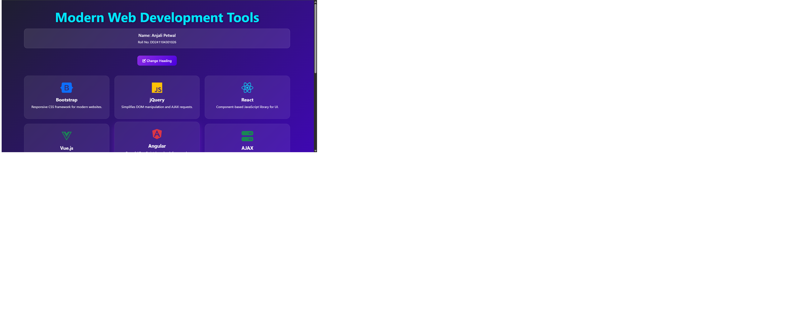

# WT Lab Practical 9 - Frameworks & Libraries

## 👩‍🎓 Student Details
**Name:** Anjali Petwal  
**Roll No:** DD241104301026  
**Subject:** Web Technology Lab  

---

## 🌐 Live Demo
🔗 https://anjalipetwal15.github.io/WT-Lab-Practical-9/

---

## 📸 Output Screenshot

---

## 🚀 Features Implemented

### ✅ Bootstrap 5
- Responsive grid system
- Modern card-based layout
- Mobile-friendly design

### ✅ Font Awesome Icons
- Interactive framework icons
- Modern UI appearance

### ✅ jQuery DOM Manipulation
- Dynamic heading change
- Smooth animations and effects

### ✅ AJAX Simulation
- Dynamic content loading
- No page refresh required

### ✅ Interactive JavaScript Features
- Button click events
- Search functionality
- Loading animation

### ✅ Modern UI/UX
- Gradient background
- Glassmorphism effect
- Hover animations
- Fully responsive design

---

## 🛠️ Technologies Used

- HTML5
- CSS3
- Bootstrap 5
- JavaScript
- jQuery
- Font Awesome

---

## 📱 Responsive Design
The webpage is fully responsive and works smoothly on:
- Mobile Devices
- Tablets
- Laptops
- Desktop Screens

---

## 📚 Learning Outcomes
Through this practical, the following concepts were explored:

- Front-end frameworks
- Responsive web design
- DOM manipulation using jQuery
- AJAX-based dynamic updates
- Interactive UI development

---

## © 2026 Anjali Petwal
WT Lab Practical 9
